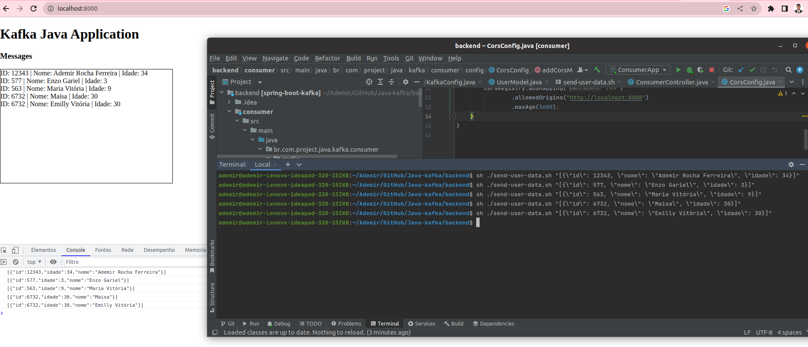

# spring-boot-kafka

## Pré requisitos

- Maven 3+
- Java 8+
- Docker 18.02.0+ 

## Preparando ambiente backend

- Entre na pasta backend com o comando `cd backend`.
- Execute o `docker-compose up` para inicializar o Zookeeper e Kafka.
- Execute `mvn clean package` na pasta do projeto para realizar o build das aplicações.

## Executando 

- Inicialize o projeto `producer` pelos comandos abaixo ou diretamente na IDE
````
cd producer
mvn spring-boot:run
````

Obs: a aplicação Producer disponibiliza o endpoint `POST http://localhost:8080/producer/user-data` para receber os eventos dos pedidos.


-  Inicialize o projeto `consumer` pelos comandos abaixo ou diretamente na IDE
````
cd consumer
mvn spring-boot:run
````

Obs: a aplicação Producer disponibiliza o endpoint ` http://localhost:8083/consumer/user-data` para conectar novos clientes e enviar os eventos receidos.


## Enviar Dados de Teste 


Para testar, pode ser utilizado o seguinte comando: `sh ./send-user-data.sh "[{\"id\": 12343, \"nome\": \"Ademir Rocha Ferreira\", \"idade\": 34}]"`, onde será inserido o pedido no tópico do Kafka, via a aplicação `producer`, e será cosumido pela aplicação `consumer`, como no log abaixo:

````
2023-06-01 23:11:38.492  INFO 18449 --- [umer-user-0-C-1] b.c.p.j.k.c.services.ConsumerService     : User: [{id=12343, nome=Ademir Rocha Ferreira, idade=34}] 
````


## Executar o frontend

O frontend possui apenas um arquivo html que faz as requisições para o consumer.

- Entre na pasta frontend com o comando `cd frontend`.

Se possuir o php instalado, use o para rodar o frontend com o comando abaixo:

`php -S localhost:8000`

agora abra o navegador em [http://localhost:8000](http://localhost:8000)


Caso não possua o PHP instalado, pode abrir o arquivo index.html diretamente no navegador, mas precisa abrir o CorsConfig no projeto consumer e habilitar o allowedOrigins com `*`.

Após isso é só enviar dados para o producer que irão aparcer na página do navegador.


## Exemplo de Resultado

